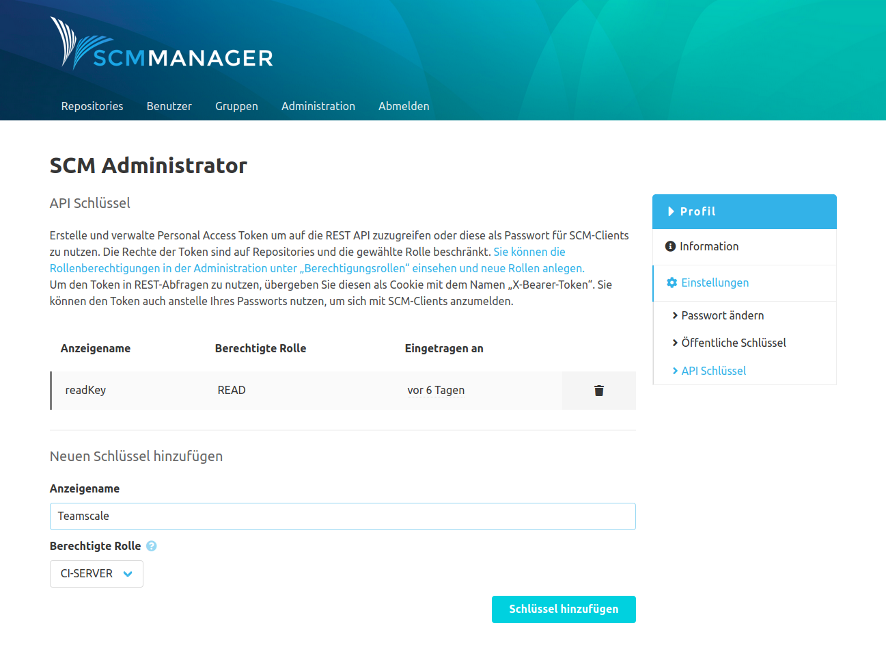

Über den Link zum Profil im Footer können Einstellungen zum eigenen Konto vorgenommen werden.

## Passwort ändern

Hier kann das Passwort für das Konto geändert werden, wenn es sich um ein lokales Konto handelt (wenn die Anmeldung
also nicht über ein Fremdsystem erfolgt). Um die Änderung zu autorisieren, muss zunächst das aktuelle Passwort
eingegeben werden. Danach muss das neue Passwort zweimal eingegeben werden.

## Öffentliche Schlüssel

Zum Prüfen von Signaturen für z. B. Commits können hier die entsprechenden öffentlichen Schlüssel hinterlegt werden.
Zudem können hier die vom SCM-Manager erstellten Signaturschlüssel heruntergeladen werden.

## API Schlüssel

Zur Nutzung in anderen Systemen wie z. B. CI Systemen können sogenannte API Schlüssel erstellt werden. Sie können für
den Zugriff auf Repositories über die REST API sowie über SCM-Clients genutzt werden. Dazu wird ein Anzeigename sowie
eine [Rolle](../admin/roles/) ausgewählt. Der Anzeigename ist ausschließlich zur Verwaltung gedacht und hat keine
weitere technische Bewandnis. Mithilfe der Rolle können die Berechtigungen eingeschränkt werden, die bei einer Anmeldung
zur Verfügung stehen.

Hat z. B. ein Konto schreibende Rechte für ein Repository und wird ein API-Schlüssel mit der Rolle "READ" erzeugt, so
kann über diesen Schlüssel nur lesend auf das Repository zugegriffen werden. Eine Ausweitung der Rechte hingegen ist
selbstverständlich nicht möglich. Es kann also mithilfe eines API-Schlüssels mit der Rolle "WRITE" nicht schreibend auf
ein Repository zugegriffen werden, für das bei dem Konto nur ein lesender Zugriff gestattet ist.



Nach der Erstellung eines Schlüssels, wird dieser **einmalig** angezeigt. Nachdem dieses Fenster
geschlossen wurde, kann der Schlüssel nicht mehr abgerufen und nicht wiederhergestellt werden.


### Beispiel REST API

Um einen Schlüssel mit der REST API zu nutzen, muss der Schlüssel als Cookie mit dem Namen „X-Bearer-Token“
übergeben werden. Für die Nutzung mit curl sieht ein Aufruf z. B. wie folgt aus:

```
curl -v localhost:8081/scm/api/v2/repositories/ -H "Cookie: X-Bearer-Token=eyJhcGlLZXlJZCI...RTRHeCJ9"
```

### Zugriff mit SCM-Client

Für einen Zugriff mit einem SCM-Client (z. B. `git`, `hg` oder `svn`) muss der Schlüssel als Passwort übergeben werden.
