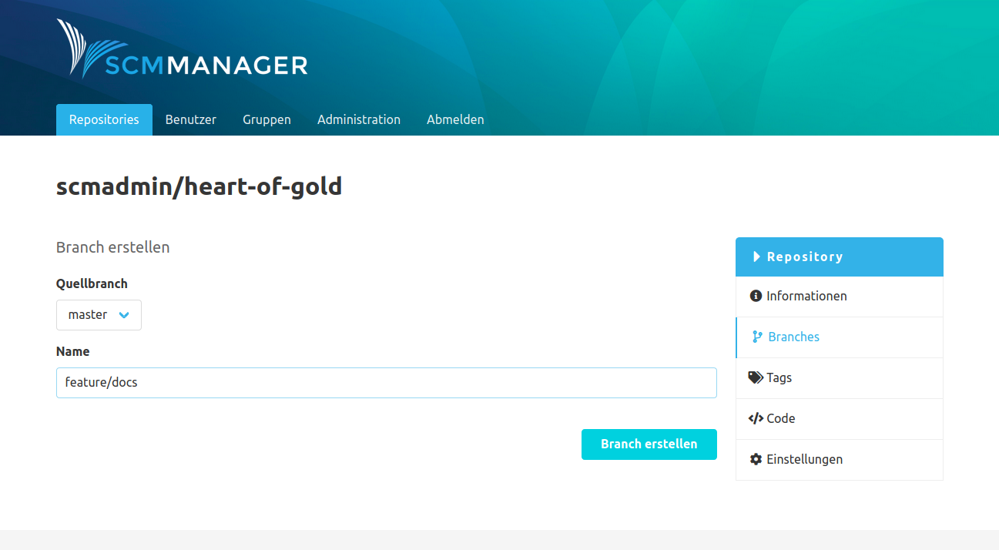

### Übersicht
Auf der Branches-Übersicht sind die bereits existierenden Branches aufgeführt. Bei einem Klick auf einen Branch wird man zur Detailseite des Branches weitergeleitet.
Die Branches sind in zwei Listen aufgeteilt: Unter "Aktive Branches" sind Branches aufgelistet, deren letzter Commit
nicht 30 Tage älter als derjenige des Default-Branches ist. Alle weiteren Branches sind in der Liste "Stale Branches" zu finden.

Der Tag "Default" gibt an, welcher Branch aktuell als Standard-Branch dieses Repository im SCM-Manager markiert ist. Der Standard-Branch wird immer zuerst angezeigt, wenn man das Repository im SCM-Manager öffnet.
Alle Branches mit Ausnahme des Default Branches können über den Mülleimer-Icon unwiderruflich gelöscht werden.

Über den "Branch erstellen"-Button gelangt man zum Formular, um neue Branches anzulegen.

### Branch erstellen
Mit dem "Branch erstellen"-Formular können neue Branches für das Repository erzeugt werden. Dafür muss ausgewählt werden von welchem existierenden Branch der neue Branch abzweigen soll und wie der neue Branch heißen soll. In einem leeren Git Repository können keine Branches erzeugt werden.

### Branch Detailseite
Hier werden einige Befehle zum Arbeiten mit dem Branch auf einer Kommandozeile aufgeführt.

Handelt es sich nicht um den Default Branch des Repositories, kann im unteren Bereich der Branch unwiderruflich gelöscht werden.

