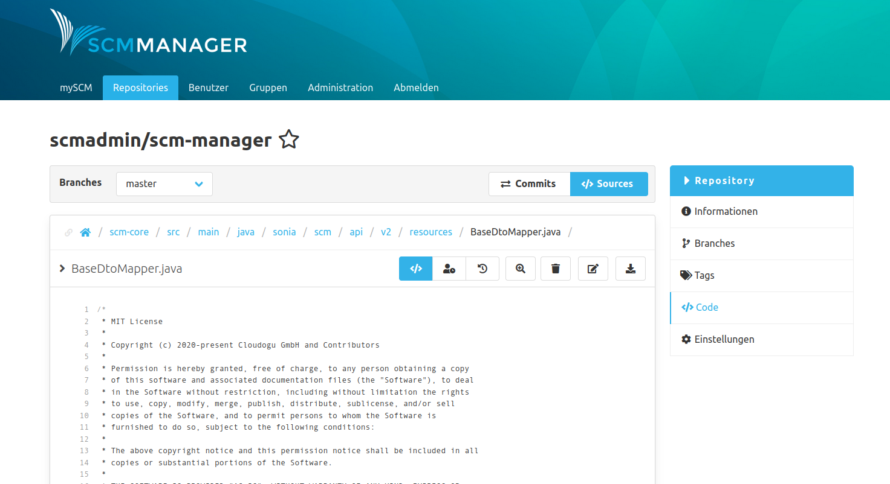
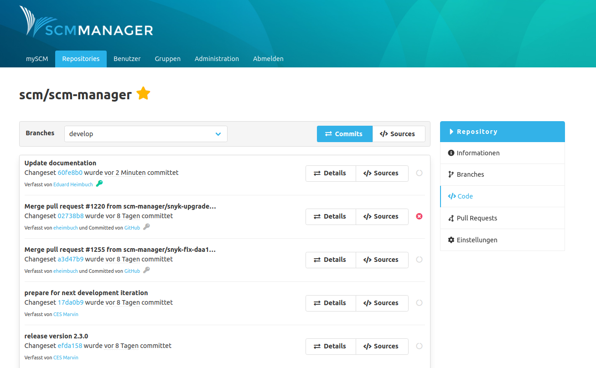
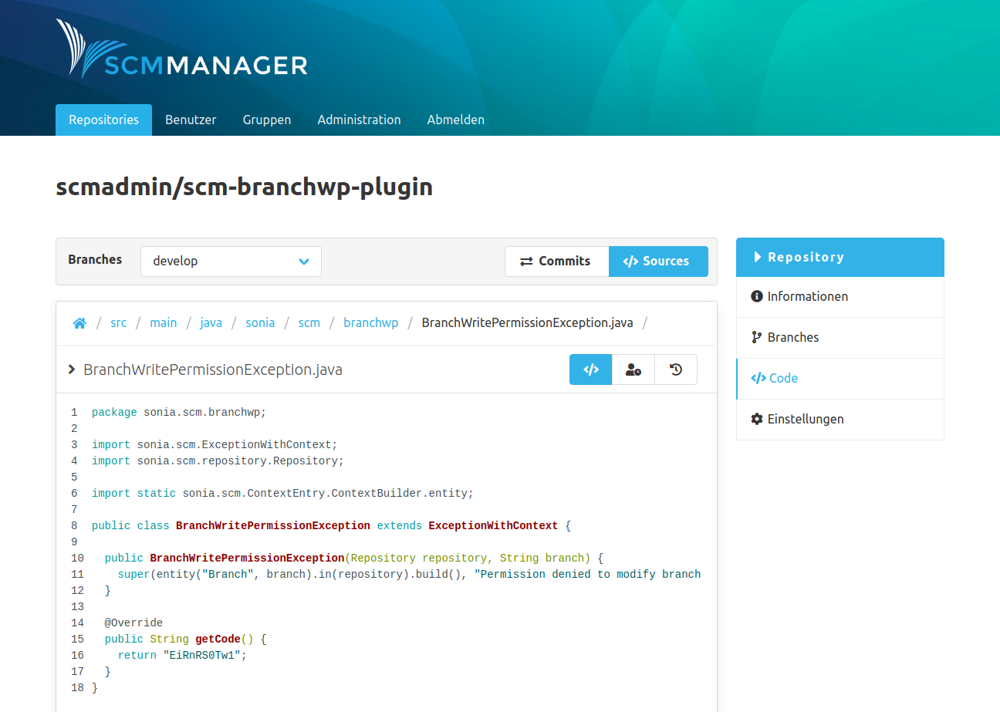

Die Sektion "Code" enthält sämtliche Informationen, die sich auf den Code bzw. Inhalt des Repository beziehen. Oben auf der Seite befindet sich ein Aktionsbalken über den innerhalb der Code-Sektion navigiert werden kann. 

### Sources
Die Übersicht der Sources zeigt die Dateien und Ordner in dem Repository an. Wenn Branches existieren, werden die Sources für den ausgewählten Branch angezeigt. 

Es gibt unter dem Aktionsbalken eine Breadcrumbs Navigation, die den Pfad der angezeigten Dateien darstellt. Durch Klicken auf die einzelnen Pfad-Bestandteile, kann man sich durch die Dateistruktur des Repository (zurück-)navigieren.

### Changesets
Die Übersicht der Changesets/Commits zeigt die Änderungshistorie je Branch an. Jeder Listeneintrag stellt einen Commit dar. 

Über den Details-Button kann man sich den Inhalt / die Änderungen dieses Changesets ansehen. 

Der Schlüssel Icon zeigt an, ob ein Changeset signiert wurde. Um die Signatur zu validieren, können die Benutzer ihre öffentlichen Schlüssel (Public Keys) im SCM-Manager hinterlegen. Ein grüner Schlüssel bedeutet die Signatur konnte erfolgreich gegen einen hinterlegten öffentlichen Schlüssel im SCM-Manager verifiziert werden. Ein grauer Schlüssel heißt, dass die Signatur zu keinem Schlüssel im SCM-Manager passt. Und ein roter Schlüssel warnt vor einer ungültigen (möglicherweise gefälschten) Signatur.

Über den Sources-Button gelangt man zur Sources-Übersicht und es wird der Datenstand zum Zeitpunkt nach diesem Commit angezeigt.

### Changeset Details
Auf der Detailseite eines Changesets sieht man zusätzlich zu den Metadaten (z. B. Mitwirkende und Parent-Changeset) des Changesets sämtliche Änderungen, die in diesem Changeset enthalten sind. 
Die Mitwirkenden können zu einer detaillierten Tabelle aufklappt werden und enthalten den Autor, die Co-Autoren, den Committer und den Signierer des Changesets. 
Die Diffs werden dabei im bekannten Format je Datei inklusive Syntax-Highlighting angezeigt. 
Die Diffs können durch Klicken auf den blauen Balken schrittweise oder vollständig erweitert werden.

Falls sich Commit Links im Format "namespace/name@commitId" in der Changeset Beschreibung befinden, werden die zu relativen SCM-Manager Links erweitert.
Beispielsweise wird der Text hitchhiker/HeartOfGold@1a2b3c4 zu einem Link zu dem Commit 1a2b3c4 im Repository hitchhiker/HeartOfGold umgewandelt.

### Datei Details
Nach einem Klick auf eine Datei in den Sources landet man in der Detailansicht der Datei. Dabei sind je nach Dateiformat unterschiedliche Ansichten zu sehen: 

- Bild-Datei: Bild wird gerendert angezeigt. 
- Markdown-Datei: Markdown wird gerendert dargestellt. Die Ansicht kann auf eine nicht gerenderte Textansicht umgeschaltet werden. Im gerenderten Markdown können ebenfalls Commit Links wie bei den Changeset Details verwendet werden.
- Text-basierte Datei: Der Text wird angezeigt. Falls verfügbar mit Syntax-Highlighting.
- Nicht unterstützte Formate: Ein Download-Button wird angezeigt.

### Datei Annotate
Ergänzt jede Codezeile mit entsprechenden Informationen, wann und von welchem Autor diese zuletzt geändert wurde. Mit einem Hover auf der linken Seite erscheint ein Popover mit Changeset und weiteren Informationen.

### Datei Historie
Bei der Datei Details Ansicht kann man über einen Switch oben rechts auf die Historien-Ansicht wechseln. Dort werden die Commits aufgelistet, die diese Datei verändert haben.

