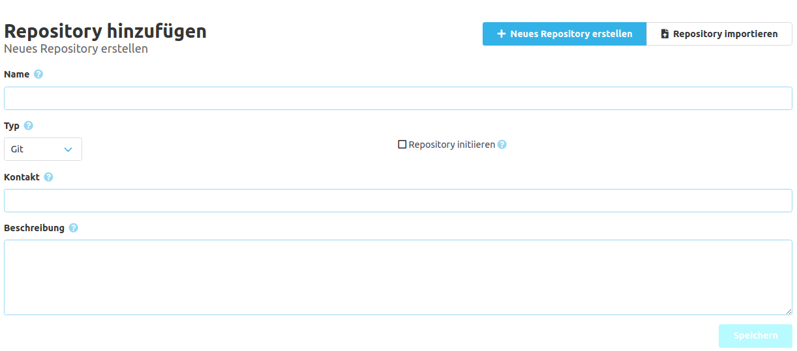
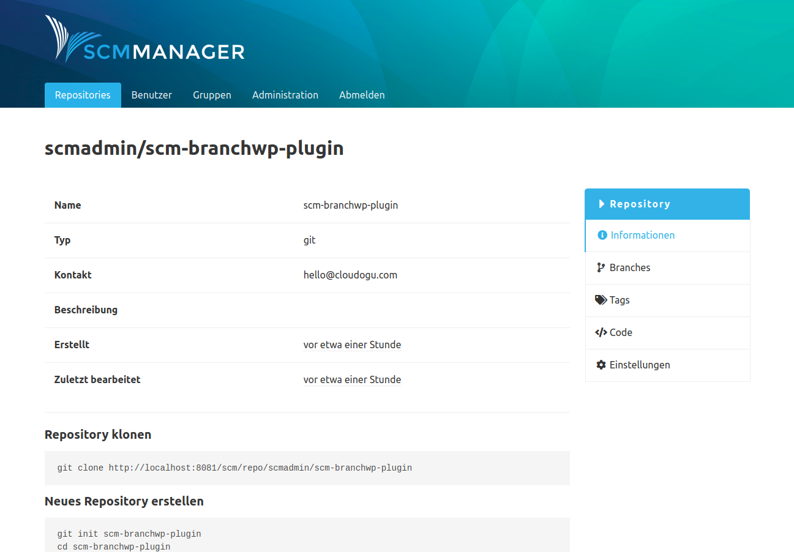

Der Bereich Repository umfasst alles auf Basis von Repositories in Namespaces. Dazu zählen alle Operationen auf Branches, der Code und Einstellungen.

* [Branches](branches/)
* [Code](code/)
* [Einstellungen](settings/)

### Übersicht
Auf der Übersichtsseite der Repositories werden die einzelnen Repositories nach Namespaces gegliedert aufgelistet. Jedes Repository wird durch eine Kachel dargestellt. Durch einen Klick auf diese Kachel öffnet sich die Readme Seite des jeweiligen Repositories. 

Über die Suchleiste oben können die Repositories gefiltert werden. Die Suche filtert dabei nach dem Namen und der Beschreibung des Repositories.

Ein bestimmter Tab des Repositories wie Branches, Changesets oder Sources kann über die blauen Icons geöffnet werden. 

Icon             |  Beschreibung
---|---
  |  Öffnet die Branches-Übersicht für das Repository
 | Öffnet die Changesets-Übersicht für das Repository
 | Öffnet die Sources-Übersicht für das Repository
 | Öffnet die Einstellungen für das Repository

### Repository erstellen
Im SCM-Manager können neue Git, Mercurial & Subersion (SVN) Repositories über ein Formular angelegt werden. Dieses kann über den Button "Repository erstellen" aufgerufen werden. Dabei muss ein gültiger Name eingetragen und der Repository-Typ bestimmt werden. 
 
Optional kann man das Repository beim Erstellen direkt initialisieren. Damit werden für Git und Mercurial jeweils der Standard-Branch (master bzw. default) angelegt. Außerdem wird ein initialer Commit ausgeführt, der eine README.md erzeugt.

Ist die Namespace-Strategie auf "Benutzerdefiniert" eingestellt, muss noch ein Namespace eingetragen werden.

### Repository Informationen
Die Informationsseite eines Repository zeigt die Metadaten zum Repository an. Darunter befinden sich Beschreibungen zu den unterschiedlichen Möglichkeiten wie man mit diesem Repository arbeiten kann.

