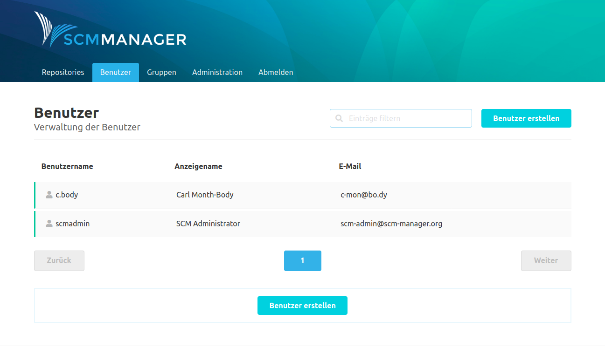
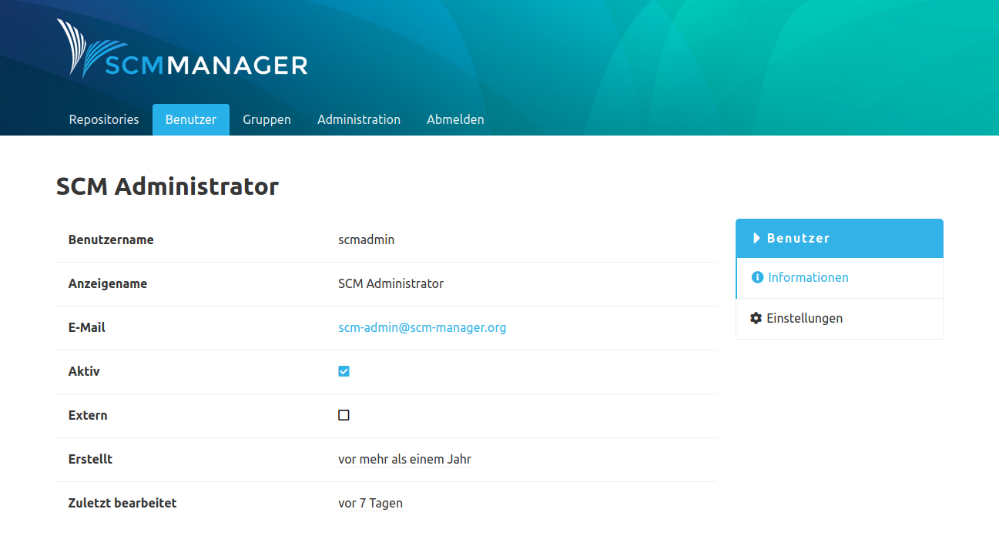

<!--- AppendLinkContentStart -->
Der Bereich Benutzer umfasst alles, was auf einen einzelnen Anwender und dessen Berechtigungen herunterzubrechen ist.

* [Einstellungen](settings/)
<!--- AppendLinkContentEnd -->

### Übersicht
Auf der Benutzer Übersichtsseite wird eine Liste der existierenden Benutzer angezeigt. Durch Klicken auf einen Benutzer gelangt man zu dessen Detailseite. Über die Schaltfläche "Benutzer erstellen" können neue Benutzer angelegt werden.

### Benutzer erstellen
Mithilfe des "Benutzer erstellen"-Formulars können neue Benutzer im SCM-Manager angelegt werden. Neue Benutzer haben noch keine Berechtigungen und sollten direkt nach dem Anlegen konfiguriert werden.

### Benutzer Detailseite
Die Detailseite eines Benutzers zeigt die Informationen zu diesem an. 

Über den "Aktiv"-Marker sieht man, ob dies ein aktivierter Benutzer des SCM-Managers ist. Wird ein Benutzer auf inaktiv gesetzt, kann er sich nicht mehr am SCM-Manager anmelden.

Der Typ eines Benutzers gibt an, aus welcher Quelle dieser Benutzer stammt. Der Typ "XML" aus dem Beispiel gibt an, dass dieser Benutzer im SCM-Manager erstellt wurde. Daneben kann es aber auch externe Benutzer geben, die beispielweise mithilfe des LDAP-Plugins aus einer LDAP-Instanz angebunden wurden. 

